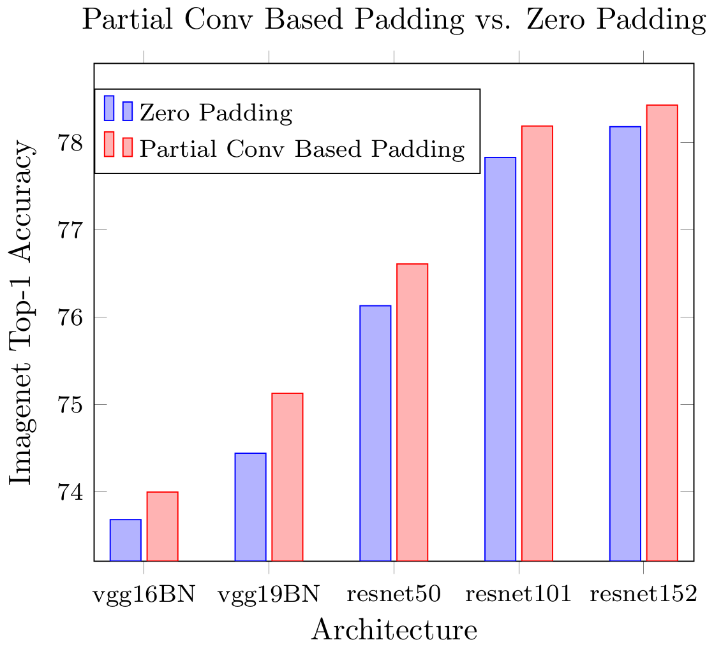

# Partial Convolution Layer for Padding and Image Inpainting
### [Padding Paper](https://arxiv.org/pdf/1811.11718.pdf) | [Inpainting Paper](https://arxiv.org/abs/1804.07723) | [Inpainting YouTube Video](https://www.youtube.com/watch?v=gg0F5JjKmhA)

This is the PyTorch implementation of partial convolution layer. It can serve as a new padding scheme; it can also be used for image inpainting. <br><br>


[Partial Convolution based Padding](https://arxiv.org/pdf/1811.11718.pdf) <br>
[Guilin Liu](https://liuguilin1225.github.io/), [Kevin J. Shih](http://web.engr.illinois.edu/~kjshih2/), [Ting-Chun Wang](https://tcwang0509.github.io/), [Fitsum A. Reda](https://scholar.google.com/citations?user=quZ_qLYAAAAJ&hl=en), [Karan Sapra](http://cecas.clemson.edu/~ksapra/), [Zhiding Yu](https://chrisding.github.io/), Andrew Tao, [Bryan Catanzaro](http://catanzaro.name/) <br>
NVIDIA Corporation <br>
Technical Report (**Technical Report**) 2018


[Image Inpainting for Irregular Holes Using Partial Convolutions](https://arxiv.org/abs/1804.07723) <br>
[Guilin Liu](https://liuguilin1225.github.io/), [Fitsum A. Reda](https://scholar.google.com/citations?user=quZ_qLYAAAAJ&hl=en), [Kevin J. Shih](http://web.engr.illinois.edu/~kjshih2/), [Ting-Chun Wang](https://tcwang0509.github.io/), Andrew Tao, [Bryan Catanzaro](http://ctnzr.io/) <br>
NVIDIA Corporation <br>
In The European Conference on Computer Vision (**ECCV**) 2018  <br> <br>


## Comparison with Zero Padding
<p align='center'>  
  
</p>

## Comparison with Zero Padding, Reflection Padding and Replication Padding for 5 runs
<p align='center'>  
  
<!--    -->
</p>

The best top-1 accuracies for each run with 1-crop testing. \*\_zero, \*\_pd, \*\_ref and \*\_rep indicate the corresponding model with zero padding, partial convolution based padding, reflection padding and replication padding respectively. \*\_best means the best validation score for each run of the training. Average represents the average accuracy of the 5 runs. Column diff represents the difference with corresponding network using zero padding. Column stdev represents the standard deviation of the accuracies from 5 runs. PT\_official represents the corresponding official accuracies published on PyTorch website: https://pytorch.org/docs/stable/torchvision/models.html


## Installation
Installation can be found: https://github.com/pytorch/examples/tree/master/imagenet


## Usage:

- using partial conv for padding
```
#typical convolution layer with zero padding
nn.Conv2d(3, 16, kernel_size=3, stride=1, padding=1, bias=False)

#partial convolution based padding
PartialConv2d(3, 16, kernel_size=3, stride=1, padding=1, bias=False)
```

- using partial conv for image inpainting, set both `multi_channel` and `return_mask` to be `True`
```
#partial convolution for inpainting (using multiple channels and updating mask)
PartialConv2d(3, 16, kernel_size=3, stride=1, padding=1, bias=False, multi_channel=True, return_mask=True)
```

## Mixed Precision Training with AMP
- typical changes needed for AMP
```
  from apex import amp
  
  #initializing model and optimizer
  self.model, self.optimizer = amp.initialize(self.model, self.optimizer, opt_level=args.amp_opt_level)
  
  #initializing vgg loss function/extractor
  self.vgg_feat_loss = amp.initialize(self.vgg_feat_loss, opt_level=args.amp_opt_level)
  
  #scale loss
  with amp.scale_loss(total_loss, self.g_optimizer) as scaled_loss:
      scaled_loss.backward()

```

- Gram matrix loss computation: change one-step division to two-step smaller divisions
  - change from [one-step division](https://github.com/NVIDIA/partialconv/blob/master/models/loss.py#L32) `gram = features.bmm(features_t) / (ch * h * w)
`  
  - to [two-step smaller divisions](https://github.com/NVIDIA/partialconv/blob/master/models/loss.py#L28)
```
  features = features / (ch * h)
  gram = features.bmm(features_t) / w
```

- Small Constant Number: make the small constant number a bit larger (e.g. 1e-8 to 1e-6)
  - change from [1e-8](https://github.com/NVIDIA/partialconv/blob/master/models/partialconv2d.py#L64) `self.mask_ratio = self.slide_winsize/(self.update_mask + 1e-8)`
  - to [1e-6](https://github.com/NVIDIA/partialconv/blob/master/models/partialconv2d.py#L63)
```
self.mask_ratio = self.slide_winsize/(self.update_mask + 1e-6)
```


## Usage of partial conv based padding to train ImageNet
- ResNet50 using zero padding (default padding)
```
python main.py -a resnet50 --data_train /path/ILSVRC/Data/CLS-LOC/train --data_val /path/ILSVRC/Data/CLS-LOC/perfolder_val --batch-size 192 --workers 32 --prefix multigpu_b192 --ckptdirprefix experiment_1/
```

- ResNet50 using partial conv based padding
```
python main.py -a pdresnet50 --data_train /path/ILSVRC/Data/CLS-LOC/train --data_val /path/ILSVRC/Data/CLS-LOC/perfolder_val --batch-size 192 --workers 32 --prefix multigpu_b192 --ckptdirprefix experiment_1/
```

- vgg16_bn using zero padding (default padding)
```
python main.py -a vgg16_bn --data_train /path/ILSVRC/Data/CLS-LOC/train --data_val /path/ILSVRC/Data/CLS-LOC/perfolder_val --batch-size 192 --workers 32 --prefix multigpu_b192 --ckptdirprefix experiment_1/
```

- vgg16_bn using partial conv based padding
```
python main.py -a pdvgg16_bn --data_train /path/ILSVRC/Data/CLS-LOC/train --data_val /path/ILSVRC/Data/CLS-LOC/perfolder_val --batch-size 192 --workers 32 --prefix multigpu_b192 --ckptdirprefix experiment_1/
```

### Pretrained checkpoints (weights) for VGG and ResNet networks with partial convolution based padding:
```
https://www.dropbox.com/sh/t6flbuoipyzqid8/AACJ8rtrF6V5b9348aG5PIhia?dl=0
```


## Citation
```
@inproceedings{liu2018partialpadding,
   author    = {Guilin Liu and Kevin J. Shih and Ting-Chun Wang and Fitsum A. Reda and Karan Sapra and Zhiding Yu and Andrew Tao and Bryan Catanzaro},
   title     = {Partial Convolution based Padding},
   booktitle = {arXiv preprint arXiv:1811.11718},   
   year      = {2018},
}
@inproceedings{liu2018partialinpainting,
   author    = {Guilin Liu and Fitsum A. Reda and Kevin J. Shih and Ting-Chun Wang and Andrew Tao and Bryan Catanzaro},
   title     = {Image Inpainting for Irregular Holes Using Partial Convolutions},
   booktitle = {The European Conference on Computer Vision (ECCV)},   
   year      = {2018},
}
```

Contact: Guilin Liu (guilinl@nvidia.com)

## Acknowledgments
We thank Jinwei Gu, Matthieu Le, Andrzej Sulecki, Marek Kolodziej and Hongfu Liu for helpful discussions.
