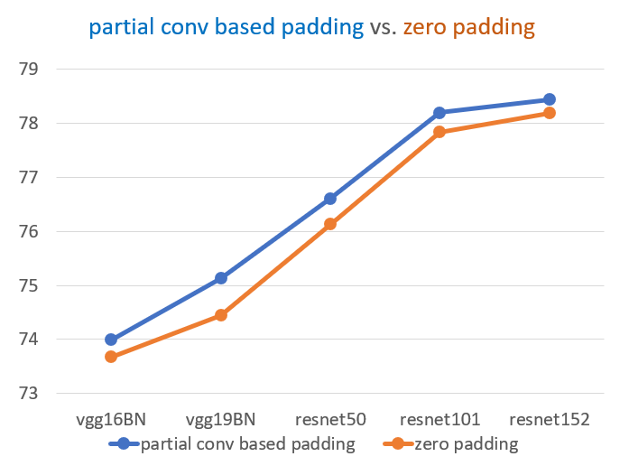
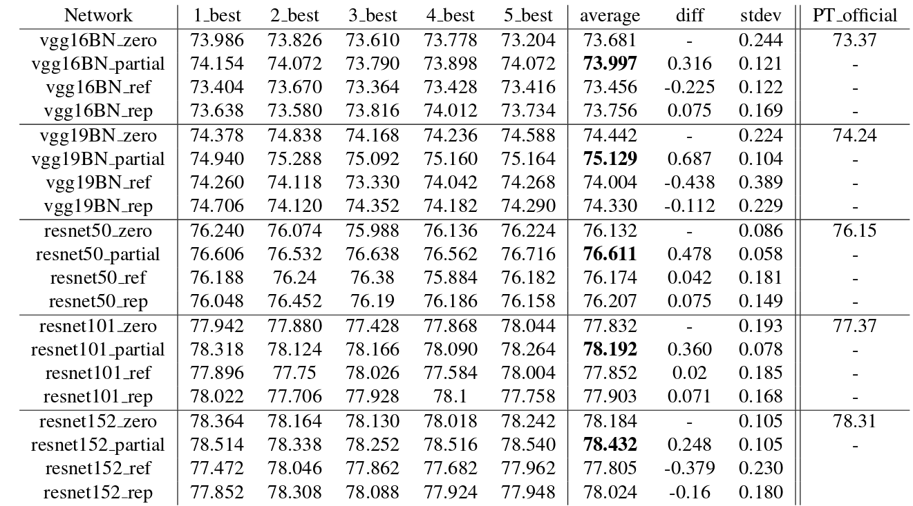
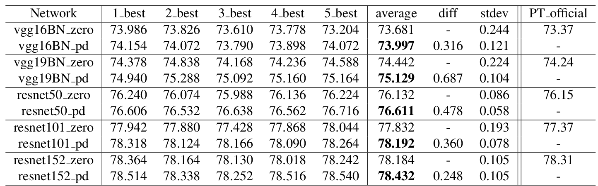

# Partial Convolution Layer for Padding and Image Inpainting
### [YouTube](https://www.youtube.com/watch?v=gg0F5JjKmhA) | [Paper](https://eccv2018.org/openaccess/content_ECCV_2018/papers/Guilin_Liu_Image_Inpainting_for_ECCV_2018_paper.pdf) | [arXiv](https://arxiv.org/abs/1804.07723)

This is the PyTorch implementation of partial convolution layer. It can be used for saving as a new padding scheme; it can also be used for image inpainting. <br><br>
[Image Inpainting for Irregular Holes Using Partial Convolutions](https://arxiv.org/abs/1804.07723/) <br>
 [Guilin Liu](https://liuguilin1225.github.io/), [Fitsum A. Reda](https://scholar.google.com/citations?user=quZ_qLYAAAAJ&hl=en), [Kevin J. Shih](http://web.engr.illinois.edu/~kjshih2/), [Ting-Chun Wang](https://tcwang0509.github.io/), Andrew Tao, [Bryan Catanzaro](http://catanzaro.name/) <br>
 NVIDIA Corporation <br>
 In The European Conference on Computer Vision (**ECCV**) 2018  <br> <br>

 [Partial Convolution based Padding](https://arxiv.org/abs/1804.07723/) <br>
 [Guilin Liu](https://liuguilin1225.github.io/), [Kevin J. Shih](http://web.engr.illinois.edu/~kjshih2/), [Ting-Chun Wang](https://tcwang0509.github.io/), [Fitsum A. Reda](https://scholar.google.com/citations?user=quZ_qLYAAAAJ&hl=en), [Karan Sapra](http://cecas.clemson.edu/~ksapra/), [Zhiding Yu](https://www.andrew.cmu.edu/user/yzhiding/index.htm), Andrew Tao, [Bryan Catanzaro](http://catanzaro.name/) <br>
 NVIDIA Corporation <br>
 Technical Report (**Technical Report**) 2018  


## Comparison with Zero Padding
<p align='center'>  
  
</p>
## Comparison with Zero Padding for 5 runs
<p align='center'>  
  
<!--    -->
</p>
The best top-1 accuracies for each run with 1-crop testing. \*\_zero, \*\_pd, \*\_ref and \*\_rep indicate the corresponding model with zero padding, partial convolution based padding, reflection padding and replication padding respectively. \*\_best means the best validation score for each run of the training. average represents the average accuracy of the 5 runs. Column diff represents the difference with corresponding network using zero padding. Column stdev represents the standard deviation of the accuracies from 5 runs. PT\_official represents the corresponding official accuracies published on PyTorch website: https://pytorch.org/docs/stable/torchvision/models.html


## Installation
Installation can be found: https://github.com/pytorch/examples/tree/master/imagenet


## Usage:

### ResNet50 using zero padding (default padding) trained on 8 GPUS
python main.py -a resnet50 --data_train /path/ILSVRC/Data/CLS-LOC/train --data_val /path/ILSVRC/Data/CLS-LOC/perfolder_val --batch-size 192 --prefix multigpu_b192 --ckptdirprefix experiment_1/

### ResNet50 using partial conv based padding
python main.py -a pdresnet50 --data_train /path/ILSVRC/Data/CLS-LOC/train --data_val /path/ILSVRC/Data/CLS-LOC/perfolder_val --batch-size 192 --prefix multigpu_b192 --ckptdirprefix experiment_1/

### vgg16_bn using zero padding (default padding)
python main.py -a vgg16_bn --data_train /path/ILSVRC/Data/CLS-LOC/train --data_val /path/ILSVRC/Data/CLS-LOC/perfolder_val --batch-size 192 --prefix multigpu_b192 --ckptdirprefix experiment_1/

### vgg16_bn using partial conv based padding
python main.py -a pdvgg16_bn --data_train /path/ILSVRC/Data/CLS-LOC/train --data_val /path/ILSVRC/Data/CLS-LOC/perfolder_val --batch-size 192 --prefix multigpu_b192 --ckptdirprefix experiment_1/


## Citation
```
@inproceedings{liu2018partialinpainting,
   author    = {Guilin Liu and Fitsum A. Reda and Kevin J. Shih and Ting-Chun Wang and Andrew Tao and Bryan Catanzaro},
   title     = {Image Inpainting for Irregular Holes Using Partial Convolutions},
   booktitle = {The European Conference on Computer Vision (ECCV)},   
   year      = {2018},
}
@inproceedings{liu2018partialpadding,
   author    = {Guilin Liu and Kevin J. Shih and Ting-Chun Wang and Fitsum A. Reda and Karan Sapra and Zhiding Yu and Andrew Tao and Bryan Catanzaro},
   title     = {Partial Convolution based Padding},
   booktitle = {arXiv preprint arXiv:****.*****},   
   year      = {2018},
}
```

Contact: Guilin Liu (guilinl@nvidia.com)

## Acknowledgments
We thank Jinwei Gu, Matthieu Le, Andrzej Sulecki, Marek Kolodziej and Hongfu Liu.